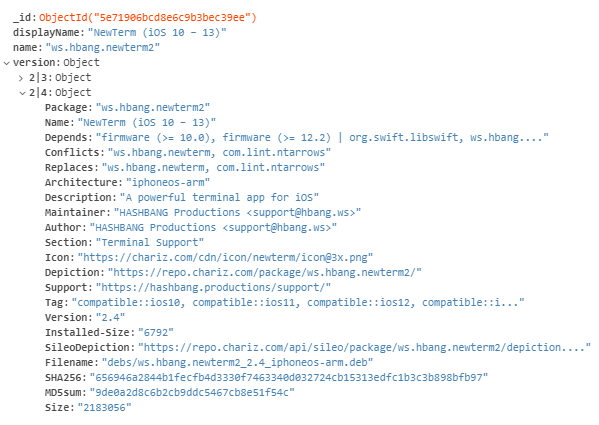

# CyRepo
 Don't look at old commits unless you're having a bad day.

# Note
* Packages are stored by their bundle ID as such:

* It's surprisingly quick! Around a minute with the current repos added, results may vary.

# How to use
Look at [start.js](./start.js) for example usage.
If you want to update packages frequently, use setInterval.

# External Dependencies
* MongoDB for storing package information.
* Node-fetch
* Seek-bzip for decoding bunzip files.

# Adding Repos
1. Get the URL of the Packages.bz2 or Packages.gz file (support for other methods coming when needed).
2. Add into [repos.txt](./repos.txt).
3. Run.
